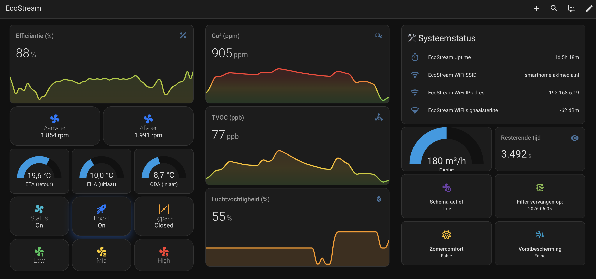

# BUVA EcoStream — Home Assistant Integration

    

A **full-featured, modern and high-performance** Home Assistant integration for the **BUVA EcoStream** balanced ventilation unit.
Supports *live push updates*, *fan control*, *boost automation*, *bypass valve*, *diagnostics*, *WiFi info*, and an **Apple Home-style dashboard**.


---

## ✨ Features

### 🔧 Core Functionality

- Local push updates (no polling required)
- Automatic WebSocket reconnect
- Eco-friendly throttled update model
- 1 unified device in the device registry
- Full diagnostics + debug logging

### 🌬 Ventilation Control

- Modern HA FanEntity API
- Percentage-based control (Qset)
- Fast-mode when adjusting ventilation
- Automatic restoration after Boost mode

### 🚀 Advanced Boost Mode

- Configurable duration (5/10/15/30 min)
- Automatic CO₂-based cancellation
- Countdown sensor (`boost_time_remaining`)
- Visual dashboard tile (optional Apple-style card)

### 🔁 Bypass Valve

- Supports:
  - `OPEN`
  - `CLOSE`
  - `SET_POSITION (0–100%)`
- Reports exact valve position

### 🌡 Sensors (rounded & refined)

- CO₂ (ppm, whole numbers)
- TVOC (ppb, whole numbers)
- Humidity (%)
- ETA, EHA, ODA temperature (1 decimal)
- RPM supply/exhaust
- Qset (%)
- Uptime (`Xd Yh Zm`)
- WIFI RSSI / SSID / IP

### 🔘 Buttons

- Reset filter timer

---

## 📦 Supported Devices

| Device            | Supported | Notes                 |
| ----------------- | --------- | --------------------- |
| BUVA EcoStream    | ✅ Yes     | All firmware versions |
| BUVA EcoStream+   | ✅ Yes     | All firmware versions |
| Other BUVA models | ❌ No      | Different protocol    |

### Firmware notes

- All known EcoStream firmware versions are supported.
- On some older firmware versions, TVOC data may not be present — the sensor will show `unavailable` rather than an error.
- The device does not expose a native WebSocket endpoint; this integration uses a safe emulated stream model compatible with all firmware versions.

---

## 📋 Supported Functions

### Sensors

| Entity                     | Unit | Description                             | Enabled by default |
| -------------------------- | ---- | --------------------------------------- | ------------------ |
| eCO₂ Return                | ppm  | CO₂ level in return air                 | ✅                  |
| TVOC Return                | ppb  | Total VOC in return air                 | ✅                  |
| Humidity Return            | %    | Relative humidity in return air         | ✅                  |
| Temperature ETA            | °C   | Extract air temperature                 | ✅                  |
| Temperature EHA            | °C   | Exhaust air temperature                 | ✅                  |
| Temperature ODA            | °C   | Outside air temperature                 | ✅                  |
| Bypass Position            | %    | Current bypass valve position           | ✅                  |
| Qset                       | m³/h | Active ventilation flow setpoint        | ✅                  |
| Heat Recovery Efficiency   | %    | Calculated heat recovery efficiency     | ❌                  |
| Mode Time Left             | s    | Remaining time for active override mode | ✅                  |
| Frost Protection Active    | —    | Whether frost protection is active      | ✅                  |
| Fan Exhaust Speed          | rpm  | Exhaust fan speed                       | ❌                  |
| Fan Supply Speed           | rpm  | Supply fan speed                        | ❌                  |
| Schedule Enabled           | —    | Whether a schedule is active            | ✅                  |
| Summer Comfort Enabled     | —    | Whether summer comfort mode is active   | ✅                  |
| Summer Comfort Temp        | °C   | Summer comfort temperature threshold    | ✅                  |
| Filter Replacement Date    | date | Date of last filter reset               | ✅ (diagnostic)     |
| Filter Replacement Warning | —    | Whether filter replacement is overdue   | ✅ (diagnostic)     |
| Uptime                     | —    | Device uptime formatted as `Xd Yh Zm`   | ❌ (diagnostic)     |
| WiFi IP                    | —    | Device IP address                       | ✅                  |
| WiFi SSID                  | —    | Connected WiFi network name             | ✅                  |
| WiFi RSSI                  | dBm  | WiFi signal strength                    | ✅                  |
| Boost Time Remaining       | s    | Remaining boost mode countdown          | ✅                  |

### Controls

| Entity         | Platform | Description                                                   |
| -------------- | -------- | ------------------------------------------------------------- |
| Ventilation    | Fan      | Set ventilation speed (percentage / preset: low / mid / high) |
| Qset           | Number   | Directly set the ventilation flow in m³/h                     |
| Bypass Valve   | Valve    | Open, close, or set bypass valve position (0–100%)            |
| Schedule       | Switch   | Enable or disable the ventilation schedule                    |
| Summer Comfort | Switch   | Enable or disable summer comfort mode                         |
| Boost          | Switch   | Start or stop boost mode                                      |
| Boost Duration | Select   | Configure boost duration (5 / 10 / 15 / 30 min)               |

---

## 🔄 Data Updates

This integration uses a **local push** model — the EcoStream device sends data to Home Assistant over a persistent HTTP long-poll connection (emulated WebSocket stream), without Home Assistant polling the device.

### How it works

1. On startup, the coordinator opens a persistent connection to the device's HTTP endpoint.
2. The device streams JSON state updates whenever its internal state changes.
3. The coordinator receives each update and immediately notifies all entities.
4. There is no fixed polling interval — updates arrive as fast as the device sends them.

### Throttling

To avoid excessive entity writes during rapid changes (e.g., when adjusting fan speed), the integration applies two configurable throttle windows:

| Mode                 | Default | When active                  |
| -------------------- | ------- | ---------------------------- |
| Normal push interval | 3 s     | Idle / steady state          |
| Fast push interval   | 1 s     | During active manual control |

These can be adjusted under **Settings → Devices & Services → EcoStream → Configure**.

### Reconnection

If the connection to the device is lost, the coordinator will automatically attempt to reconnect using exponential back-off. Entities are marked `unavailable` until the connection is restored.

---

## 🎯 Use Cases

### Ventilate on high CO₂

Automatically increase ventilation when CO₂ levels are elevated and return to normal when air quality improves.

### Night-time schedule

Use the Schedule switch to let the device follow its built-in time schedule overnight, and override it to a fixed low level during quiet hours via automation.

### Boost after cooking or shower

Trigger a timed boost when a motion sensor or humidity spike is detected in kitchen or bathroom, and let it auto-cancel when CO₂ drops back to baseline.

### Filter maintenance reminder

Use the Filter Replacement Warning sensor to send a notification when filter replacement is overdue, or create a persistent notification that clears when the filter is reset.

### Summer bypass automation

Monitor the outdoor temperature sensor and toggle Summer Comfort mode automatically when conditions are suitable for free cooling via the bypass valve.

---

## 📦 Installation

### 🔹 Option A — HACS (Custom Repository)

1. Go to **HACS → Integrations → Custom repositories**
2. Add:  [](https://github.com/epodegrid/ecostream_homeassistant_integration)
3. Category: **Integration**
4. Install & restart Home Assistant

### 🔹 Option B — Manual

Copy the folder: custom_components/ecostream/
Into: /config/custom_components/ecostream/

Restart Home Assistant.

---

## 🚀 Adding the Integration

### 🔍 Discovery

Home Assistant will automatically find the device via:

- Zeroconf (`_http._tcp`)
- DHCP hostname patterns
- MAC address prefix

- When a BUVA EcoStream is detected on the network:
  - Home Assistant will show a "BUVA EcoStream discovered" notification.
  - The config flow opens with the IP address pre-filled.
  - You only need to click Submit.
- If auto-discovery doesn't work, unplug your Ecostream unit for 10 seconds and then plug it in.
  Home Assistant should discover it within 2 minutes. If you're handy and know (how to find) the IP-address,
  then fill it in manually. Fixed IP is preferred! But since the Ecostream will normally never disconnect
  longer than 1 hour on the network, the IP-address will always be the same.

Click the discovered device → **the IP address will now be pre-filled automatically** (see section below).

### 🧩 Manual setup

1. Go to **Settings → Devices & Services**
2. Click **Add Integration**
3. Search for **EcoStream**
4. Enter the **IP address**, if not discovered automatically

---

## 🗑 Removing the Integration

1. Go to **Settings → Devices & Services**
2. Find **BUVA EcoStream** and click on it
3. Click the **⋮ menu** (three dots) in the top right
4. Select **Delete**
5. Confirm the removal
6. Restart Home Assistant

If you installed manually, also delete the folder `config/custom_components/ecostream/`.

---

## ⚙️ Options

### Update intervals

You can adjust:

- Normal push interval
- Fast push interval during manual control

These settings are available in **Options → Integration settings**.

---

## 🔧 Troubleshooting

### Device not discovered

- Unplug the EcoStream for 10 seconds and plug it back in. HA should detect it within 2 minutes.
- Make sure Home Assistant and the EcoStream are on the same network/VLAN.
- If discovery still fails, add the integration manually using the device IP address.
- Assign a static IP address to the device in your router's DHCP settings to prevent future IP changes.

### Entities show "Unavailable"

- The integration lost connection to the device. Check that the device is reachable on your network.
- Go to **Settings → Devices & Services → EcoStream** and check the integration status.
- Enable debug logging (see below) and look for connection errors in the logs.
- Restart Home Assistant. The coordinator will attempt to reconnect automatically.

### TVOC sensor always unavailable

- This is expected on some older EcoStream firmware versions that do not expose TVOC data.

### Fan control has no effect

- Ensure the Schedule switch is **off** — an active schedule may override manual control.
- Check if Boost mode is active; boost takes priority over manual fan control.

### Boost does not cancel automatically

- Automatic CO₂-based cancellation only triggers if the eCO₂ sensor reports a value below the threshold.
- Verify the eCO₂ sensor is returning valid data (not `unavailable`).

### Enable debug logging

Add the following to your `configuration.yaml`:

```yaml
logger:
  default: info
  logs:
    custom_components.ecostream: debug
```

Then restart Home Assistant and check **Settings → Logs** for detailed output.

### Download diagnostics

Go to **Settings → Devices & Services → BUVA EcoStream → Download Diagnostics** for a full state snapshot including connection info, current data, and sanitized WiFi details.

---

## 💡 Automation Examples

### Boost on high CO₂

```yaml
alias: EcoStream — Boost on high CO₂
trigger:
  - platform: numeric_state
    entity_id: sensor.ecostream_eco2_return
    above: 1000
condition:
  - condition: state
    entity_id: switch.ecostream_boost
    state: "off"
action:
  - service: switch.turn_on
    target:
      entity_id: switch.ecostream_boost
```

### Notify on filter overdue

```yaml
alias: EcoStream — Filter replacement reminder
trigger:
  - platform: state
    entity_id: binary_sensor.ecostream_filter_replacement_warning
    to: "on"
action:
  - service: notify.mobile_app
    data:
      title: "Filter replacement needed"
      message: "The EcoStream filter is overdue for replacement."
```

### Enable summer comfort on warm days

```yaml
alias: EcoStream — Summer comfort on warm days
trigger:
  - platform: numeric_state
    entity_id: sensor.ecostream_temperature_oda
    above: 22
action:
  - service: switch.turn_on
    target:
      entity_id: switch.ecostream_summer_comfort
```

### Low ventilation at night

```yaml
alias: EcoStream — Low ventilation at night
trigger:
  - platform: time
    at: "23:00:00"
action:
  - service: fan.set_percentage
    target:
      entity_id: fan.ecostream_ventilation
    data:
      percentage: 20
```

---

## 🛠 Diagnostics

A full snapshot is available under:
**Device → … → Download Diagnostics**

This includes:

- Current data
- Connection state
- Push intervals
- Metadata
- Sanitized WiFi info (password removed)

---

## 📑 Known Limitations

- The unit does **not** expose a real WebSocket endpoint
  → the integration uses a safe emulated stream model
- Some older firmware versions may omit TVOC data

---

## ❤️ Credits

- Original integration engineering: @epodegrid
- Rewrite to Bronze level and Apple-style UI: @Uber1337NL
- Thanks to contributers: @ricohageman and @jelle514
- Special thanks to the HA community for guidance

---

## 📜 License

MIT License — see LICENSE file
